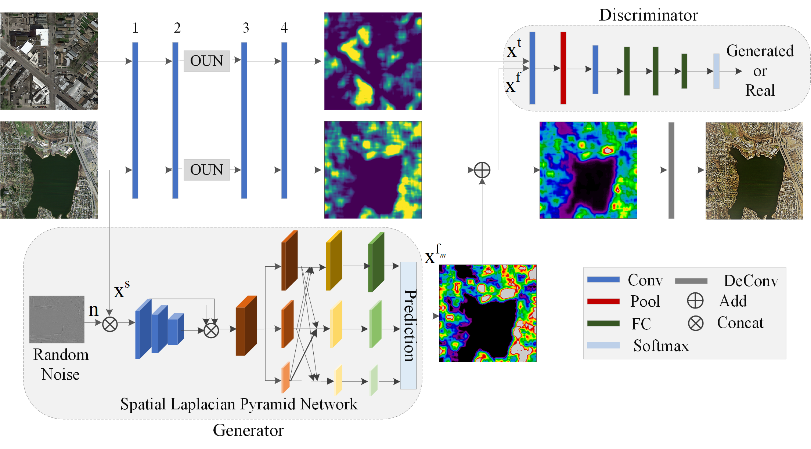
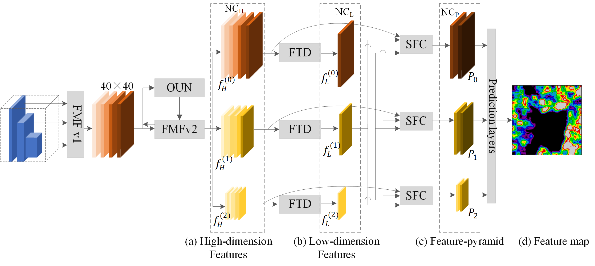

## Road Segmentation for Remote Sensing Images using Adversarial Spatial Pyramid Networks 


### ASPN Architecture

Python Implementation of ["Road Segmentation for Remote Sensing Images using Adversarial Spatial Pyramid Networks"]

<a href="http://tensorlayer.readthedocs.io">
<div align="center">
	
</div>
</a>

<a href="http://tensorlayer.readthedocs.io">
<div align="center">
	
</div>
</a>


### Results


<a href="http://tensorlayer.readthedocs.io">
<div align="center">
	
</div>
</a>

<a href="http://tensorlayer.readthedocs.io">
<div align="center">
	
</div>
</a>

<a href="http://tensorlayer.readthedocs.io">
<div align="center">
	
</div>
</a>

<a href="http://tensorlayer.readthedocs.io">
<div align="center">
	
</div>
</a>

<a href="http://tensorlayer.readthedocs.io">
<div align="center">
	
</div>
</a>

### Prepare Data

- 1. The MPII and PoseTrack dataset are available in data directory.
- 2. need to have the high resolution images for training.
  -  In this experiment, we used images from [MPII], so the hyper-paremeters in `config.py` (like number of epochs) are seleted basic on that dataset, if you change a larger dataset you can reduce the number of epochs. 
  -  If you dont want to use these dataset, you can also use [COCO](http://cocodataset.org/dataset), just simply download it using `train_hr_imgs = tl.files.load_dataset_coco2017` in `main.py`. 
  

### Citation
If you find this project useful, we would be grateful if you cite the paper：

```
@article{TOMM 2019,
author = {Pourya Shamsolmoali, Masoumeh Zareapoor, Huiyu Zhou and Jie Yang},
journal = {ACM Transactions on Multimedia Computing Communications and Applications},
title = {{AMIL: Adversarial Multi-Instance Learning for Human Pose Estimation}},
year = {2019}
}
```

