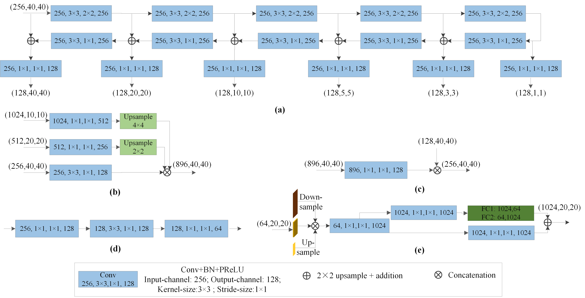

## Road Segmentation for Remote Sensing Images using Adversarial Spatial Pyramid Networks 


### ASPN Architecture

Python Implementation of ["Road Segmentation for Remote Sensing Images using Adversarial Spatial Pyramid Networks"]

<a href="http://tensorlayer.readthedocs.io">
<div align="center">
	
</div>
</a>


<a href="http://tensorlayer.readthedocs.io">
<div align="center">
	
</div>
</a>

<a href="http://tensorlayer.readthedocs.io">
<div align="center">
	
</div>
</a>
### Results


<a href="http://tensorlayer.readthedocs.io">
<div align="center">
	
</div>
</a>

<a href="http://tensorlayer.readthedocs.io">
<div align="center">
	
</div>
</a>


### Prepare Data

The dataset can be downloaded from this [kaggle link] (https://www.kaggle.com/insaff/massachusetts-roads-dataset). Some of the images in training set does not have corresponding masks. The training code filters out those images. All the images are of size 1500x1500. Code for data analysis is in this notebook. 
  

### Citation
If you find this project useful, we would be grateful if you cite the paper：

```
@article{shamsolmoali2020road,
  title={Road segmentation for remote sensing images using adversarial spatial pyramid networks},
  author={Shamsolmoali, Pourya and Zareapoor, Masoumeh and Zhou, Huiyu and Wang, Ruili and Yang, Jie},
  journal={IEEE Transactions on Geoscience and Remote Sensing},
  year={2020},
  publisher={IEEE}
}
```

